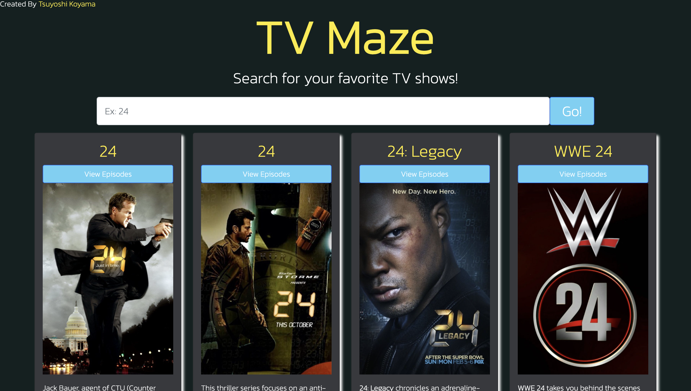
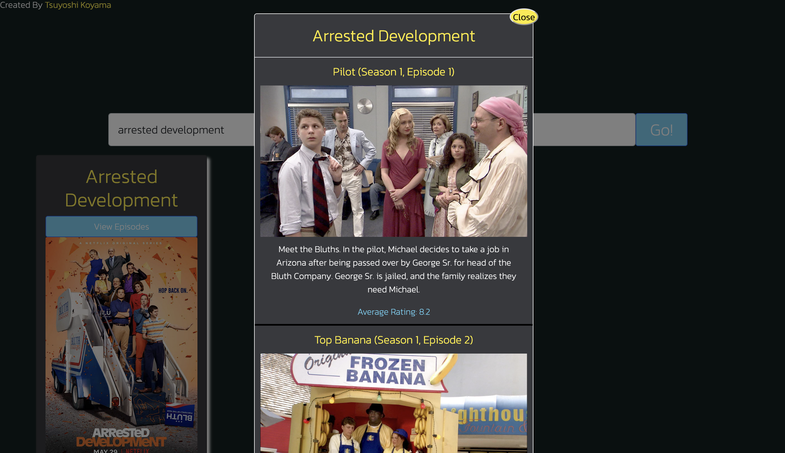

# TV Maze

## 🧐 Project Description

Who doesn't love TV shows? This is a project that I created using the TV Maze API to help you search for your next binge worthy show!

## 🤔 How to Use:

- Simply type in the name of the show you would like to search for.
- When you find a show that catches your attention, click the title of the show to learn about the show on TV Maze's website, or click "View Episodes" to show a list of all episodes - complete with title, image, summary, and rating.
- Click on the episode title to learn more about the episode on TV Maze's webiste.

### Episodes:

- Clicking on "View Episodes" will show a modal containing the episodes for that show.
- Each episode has a title (links to the TV Maze website), image (if available), and an average rating.

